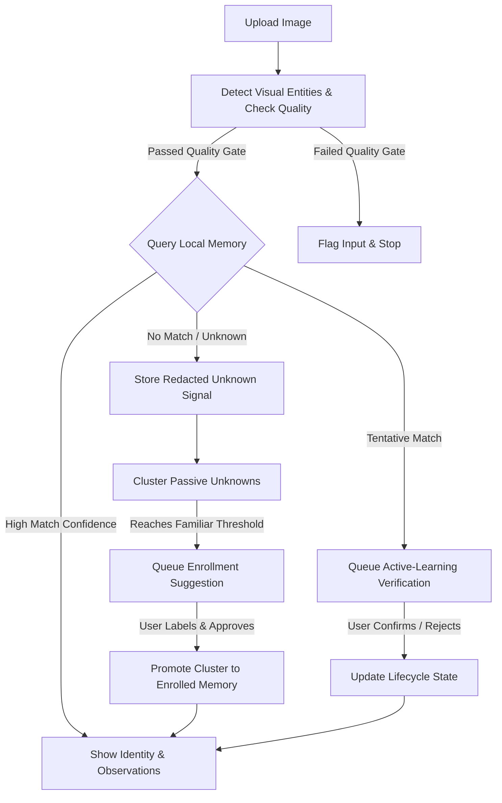
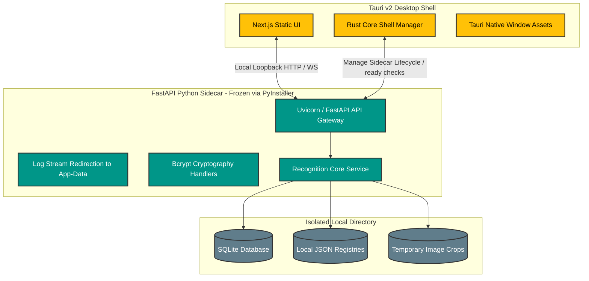

<div align="center">
  <h1>🧠 Self-Learning Vision</h1>
  <p><strong>A Local-First, Highly Expandable AI Visual Memory System</strong></p>

  <p>
    <a href="https://github.com/KanakMalpani/Self-Learning-Vision/actions/workflows/ci.yml">
      
    </a>
    <a href="LICENSE">
      
    </a>
    
    
    
    
  </p>
</div>

<hr>

**Self-Learning Vision** is a local-first visual memory engine that acts as your AI's personal visual brain. It runs completely offline to detect faces, cluster repeated unknown entities, enroll them into memory, and continuously learn from repeated encounters without compromised security, paid cloud recognition services, or remote identity databases.

Built around a **consent-forward learning loop**, the memory engine is expandable far beyond faces—serving as a modular foundation for learning about objects, places, scenes, events, and custom visual schemas you define.

Now shipping with two primary deployments: a **native, lightweight desktop application (Windows Alpha verified)** powered by **Tauri v2** and **PyInstaller**, and a full-featured **Docker multi-container stack** for developers.

> [!NOTE]
> **Privacy-First Engineering:** All biometric embeddings, crop images, local databases, and generated reports run and live strictly on your local machine. They are ignored by version control by default. 🔒

---

## 🆚 A Better Approach to Vision Memory

Traditional face recognition systems rely on sweeping public database crawling, invasive remote data uploads, or silent, automatic naming. **Self-Learning Vision** introduces a consent-forward architecture designed for personal and local workflows:

| Feature / Property | Traditional Cloud Vision | Self-Learning Vision (This Engine) |
|---|---|---|
| **Data Residency** | Centralized cloud server (High exposure) | 100% Local (Docker or isolated native user app-data boundary) |
| **Learning Trigger** | Automated background scraping & indexing | Consent-driven; user confirms familiar clusters |
| **Privacy Safeguards** | Biometrics exposed to vendor APIs | Biometrics locked locally; vector-free redacted exports |
| **AI Engine Neutrality** | Locked into proprietary APIs & subscriptions | Pluggable provider interface (Local default vs. Custom hosted) |
| **Model Expandability** | Hardcoded to single visual domains | Dynamic memory templates (People, Objects, Places, Scenes) |

---

## 📦 Choose Your Operational Path

Self-Learning Vision accommodates both lightweight offline consumers and multi-service developers:

### 📱 Path A: Native Desktop App (Windows Alpha Live)
*Designed for single-click local execution without setting up developer tools, containers, or environments.*
* **Tauri v2 + FastAPI Sidecar:** The frontend is statically exported in Next.js and wrapped in a Tauri shell, launching an automatic, windowless local FastAPI backend frozen using **PyInstaller**.
* **Zero Dependency:** SQLite backend automatically initialized locally. No Node.js, Python, Postgres, or Docker required!
* **Platform Support:** 
  * 🖥️ **Windows:** Locally verified and fully builds into native **NSIS Installers** (`.exe`) and portable zip files.
  * 🍏 **macOS & 🐧 Linux:** Foundation in place with platform-specific CI workflows next.

### 🐳 Path B: Full-Stack Docker Web Suite
*Designed for developers, server environments, and database-intensive recognition services.*
* **Enterprise Features:** Leverages PostgreSQL for relational structures, optional `pgvector` or complex local databases, and advanced providers (like InsightFace).
* **Easy Spin Up:** Standard single-command multi-container docker compose setup.

---

## 🚀 Quick Start Guide

### 📱 Setting Up the Native Desktop App (Locally or Installer)
To install the verified Windows alpha:
1. Download `Self-Learning-Vision-*-windows-x64-setup.exe` or the portable zip from the **GitHub Releases** page.
2. Run the installer (bypass unsigned publisher warning by choosing *More Info* -> *Run Anyway*).
3. The app opens instantly. The background sidecar auto-starts, binds exclusively to local loopback (`127.0.0.1`), redirects app logs, and verifies startup health via the `/ready` API.

*To compile the native desktop app locally on Windows:*
```bash
# Make sure Node.js, Rust (rustup), and Python are on your PATH.
cd apps/desktop

# 1. Install desktop shell dependencies
npm install

# 2. Build the Tauri application (compiles Rust shell, statically exports Next.js, and bundles PyInstaller backend)
npm run tauri build
```
*Locally generated installers will be saved in `apps/desktop/src-tauri/target/release/bundle/nsis/`.*

---

### 🐳 Setting Up the Docker Web Stack (In 60 Seconds)
```bash
# 1. Clone & enter the workspace
git clone https://github.com/KanakMalpani/Self-Learning-Vision.git
cd Self-Learning-Vision

# 2. Configure your local environment
cp .env.example .env

# 3. Spin up the containers
docker compose up --build
```
1. Open **[http://localhost:3000](http://localhost:3000)** in your browser.
2. Upload a sample image, select a detected face/object, name it, and save the enrollment.
3. Try uploading similar photos to see the system recognize the identity!
4. Navigate to the **Review Inbox** to see passive learning signals and active-learning questions wait for your validation.

---

## 📊 The Local Learning & Desktop Architecture

### A. The Consent-Forward Learning Loop



### B. Tauri Native Desktop Architecture



---

## ✨ Core Capabilities

### 🧠 1. Continuous Active & Passive Learning
* **Smart Clustering:** The app automatically clusters repeated occurrences of unknown visual signatures over time.
* **Evidence Bundling:** Instead of showing raw matching scores, it builds structured evidence metrics (sightings count, health scores, temporal consistency).
* **The Review Inbox:** A command-center page that ranks pending verification questions, flags contradictions, surfaces candidate memories, and offers corrections in one unified interface.

### 🔌 2. Provider-Neutral Architecture
* **Out-of-the-Box Local Pipeline:** Runs immediately on CPU/GPU without external dependencies using our high-speed, lightweight MediaPipe engine.
* **Bring-Your-Own (BYO) Provider:** Add or swap engines seamlessly (such as custom embedders or hosted model servers) by writing a short provider file conforming to the `FaceEmbeddingProvider` class contract.
* **Data-Movement Boundaries:** Safe defaults ensure hosted providers are locked down while local-only policies are active.

### 📦 3. Multidimensional Visual Memory
* **Beyond Facial Data:** Out-of-the-box templates and custom schemas for **People**, **Objects**, **Places**, **Scenes**, and **Events**.
* **Flexible Schemas:** Let users attach notes, domain-specific tags, custom attributes, and observation records to any memory entity.
* **Decaying & Reinforcing Confidence:** Observations incrementally reinforce memory confidence, while stale visual memories decay organically over time unless refreshed by fresh sightings.

### 🛡️ 4. Local Governance & Privacy Vault
* **Redacted Signals:** Active and passive learning workflows capture evidence without persisting raw images or raw biometric embeddings in database exports.
* **Zero Biometric Vector Leakage:** Seamlessly export/import a redacted privacy vault. Exported data uses standard cryptography (`cryptography` framework) for secure portability, stripping biometric vectors completely.
* **Audit Logs & Snapshots:** View detailed correction logs, trace observations, and undo memory corrections via before/after snapshots.

---

## 🎛️ Learning & Operational Policies

Self-Learning Vision lets you dictate how cautious or proactive the engine should be by toggling one of three central presets:

* **🛡️ Conservative Preset:** Strictly manual. No passive tracking or clustering of unknowns is performed. The engine only learns when you explicitly enroll a record.
* **⚖️ Balanced Preset (Recommended):** High-efficiency passive tracking. Clusters recurring unknown entities and prepares enrollment suggestions in the Review Inbox, but performs no automatic confidence adjustments without user review.
* **🧪 Experimental Preset:** Proactive learning. Leverages high-confidence passive observations to reinforce existing memories automatically, while leaving new entity promotions strictly user-gated.

---

## 📚 Complete Document Registry

This workspace contains an extensive, state-of-the-art reference standard for engineering privacy-respecting, local-first visual memory applications. Explore the complete docs folder:

| 🏁 Setup & Getting Started | 🏗️ Architecture & Core Engine | 🧪 Providers & Evaluation |
|---|---|---|
| 📦 [First Five Minutes](docs/first-five-minutes.md) | 📐 [System Architecture](docs/architecture.md) | 🧩 [Provider Guide & APIs](docs/provider-guide.md) |
| 🚀 [First Run Setup](docs/first-run.md) | 📂 [Memory Domain Models](docs/memory-domains.md) | 🔌 [Provider Marketplace](docs/provider-marketplace.md) |
| 💻 [Download Desktop Alpha](docs/download.md) | 🔄 [Memory Lifecycle States](docs/memory-lifecycle.md) | 📊 [Evaluation Dashboards](docs/evaluation-dashboard.md) |
| 🎬 [Demo Script Walkthrough](docs/demo-walkthrough.md) | 📦 [Production Upgrades](docs/v0.2-production-upgrades.md) | 📜 [Self-Learning Standards](docs/self-learning-vision-standard.md) |
| 🧑‍💻 [Local Development Guide](docs/active-learning.md) | 🔒 [Local Privacy Guidelines](docs/privacy.md) | 📈 [Quality & Metric Toolkit](docs/memory-quality-toolkit.md) |
| 📥 [Review Inbox Mechanics](docs/learning-review.md) | 📦 [Privacy Vault Controls](docs/privacy-vault.md) | 🧪 [Evaluation Methods](docs/evaluation.md) |
| 🛠️ [Correction UX Details](docs/correction-ux.md) | 🗄️ [Data Access & Controls](docs/data-controls.md) | 🛡️ [Security Boundary Guidelines](SECURITY.md) |
| 🧰 [Demo Fixtures](docs/demo-fixtures.md) | 📋 [Deployment Checklist](docs/github-launch-checklist.md) | 🤝 [Contributing Guidelines](CONTRIBUTING.md) |

---

## 💻 Manual Setup & Local Development (Web Stack)

For advanced local modifications outside of Docker:

### 🐍 Backend API Setup (FastAPI)
```bash
cd apps/api
# Create and activate virtual environment
python -m venv .venv
source .venv/bin/activate  # On Windows: .venv\Scripts\activate

# Install core and dev dependencies
pip install -r requirements.txt -c constraints.txt

# Start the development server
uvicorn app.main:app --reload --port 8000
```

### ⚡ Frontend Web Setup (Next.js)
```bash
cd apps/web
# Install dependencies
npm install

# Start Next.js local server
npm run dev
```

---

## ⚠️ Responsible AI Safety Boundary

Self-Learning Vision is engineered exclusively as a **personal, local-first visual assistant tool**. 

* **No Surveillance:** Do not deploy this software for covert identification, automated scanning of non-consenting crowds, or broad surveillance operations.
* **No Access Controls:** Do not integrate this local model for high-stakes decisions including housing, employment, access control, legal enforcement, or credit underwriting.
* **Safe Sharing:** Never share encrypted privacy vault files containing unauthorized metadata or personal references.

---

## 📄 License

This project is open-source software licensed under the [MIT License](LICENSE).
