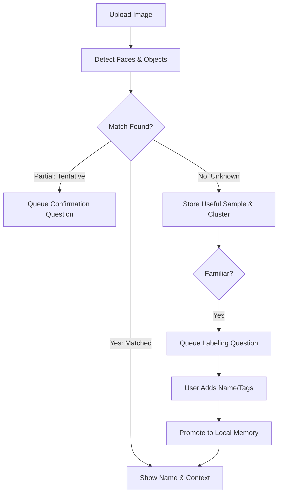

<div align="center">
  <h1>🧠 Self-Learning Vision</h1>
  <p><strong>A Local-First, Expandable Vision Memory System</strong></p>
  
  [](https://github.com/KanakMalpani/Self-Learning-Vision/actions/workflows/ci.yml)
  [](LICENSE)
  [](docker-compose.yml)
  [](apps/api)
  [](apps/web)
</div>

<hr>

Self-Learning Vision is a **local-first vision memory app**. It detects faces in uploaded images, lets you enroll people into your own local memory, recognizes them later, and **learns from repeated unknown faces** by suggesting enrollment when someone becomes familiar. 

The core memory model is expandable beyond faces into objects, places, scenes, events, and user-defined visual domains.

> **Privacy First**: The default release is intentionally local and personal. It does not require a public identity database, paid API, or cloud recognition service. 🔒

---

## 🚀 First Five Minutes

Get up and running immediately with Docker:

```bash
cp .env.example .env
docker compose up --build
```

1. Open **[http://localhost:3000](http://localhost:3000)** in your browser.
2. Upload an image you are allowed to use.
3. Run a memory check, enroll a person, and let the system learn!
4. Open the **Review Inbox** to see how active and passive learning decisions are surfaced for review.

*For the guided path, see [First Five Minutes](docs/first-five-minutes.md). For a demo script, see [Demo Walkthrough](docs/demo-walkthrough.md).*

---

## ✨ Core Features

### 🔍 Recognition & Memory
- 📸 **Upload & Detect**: Upload an image and detect visible faces.
- 👤 **Local Identity**: Select a face and compare it against locally enrolled identities.
- 📝 **Rich Context**: Enroll someone with a name, notes, and tags. Recall memory context, seen count, and last seen time.

### 🧠 Active & Passive Learning
- 🔄 **Cluster Unknowns**: Store useful unknown faces locally and cluster repeated unknown faces.
- 💡 **Smart Suggestions**: Suggest adding a familiar unknown only after repeated sightings.
- ✅ **Consent-Driven**: Promote an unknown cluster into a named identity *only* after user confirmation.
- 📉 **Health & Evidence**: Score memory health and group evidence bundles so users see why a memory is trusted.

### 🏗️ Domain Expandability
- 📦 **Beyond Faces**: Start new memories from templates for people, objects, places, scenes, events, documents, and products.
- 🛠️ **Custom Schemas**: Let users define domain-specific attributes and schemas.

### 🛡️ Privacy & Control
- 🕵️ **Redacted Signals**: Capture passive learning signals without storing raw images or embeddings.
- 📥 **Review Inbox**: Review active-learning questions, contradictions, and replay suggestions in one place.
- ⚙️ **Learning Policies**: Choose conservative, balanced, or experimental learning policy presets.
- 🗄️ **Privacy Vault**: Export/import a redacted privacy vault, with encrypted vault support.

---

## 📊 How It Works



---

## 🆚 Why It Is Different

Self-Learning Vision is built around a **consent-forward learning loop**:

- 🚫 **No Scraping**: The app learns from user-confirmed identity references, not public identity scraping.
- 🤫 **Unknowns Stay Unknown**: Unknown people stay unknown until the user names them.
- 🛑 **Cautious Matching**: Tentative matches are shown cautiously and do not update memory as trusted sightings.
- 🤖 **Replaceable AI**: Providers are replaceable. You can stay free/local or bring your own hosted model.

---

## 🔌 Provider Model: Free vs Paid

Self-Learning Vision works out of the box with the **free/local path**. Paid or hosted AI providers are optional extensions!

- 💻 **Free/Local**: Run the default Docker app and local recognition pipeline.
- ☁️ **Paid/Hosted**: Implement a custom `FaceEmbeddingProvider` and add any SDKs to an optional requirements file.
- 🛠️ **Bring-Your-Own**: Connect your own model server, edge device, or internal API.

See the [Provider Guide](docs/provider-guide.md) for more details.

---

## 📚 Documentation & Standard

We include a reference standard for building responsible self-learning vision systems:

| Setup & Usage | Architecture & Data | Providers & Evaluation |
|---|---|---|
| 🏁 [First Five Minutes](docs/first-five-minutes.md) | 🏗️ [Architecture](docs/architecture.md) | 🔌 [Provider Marketplace](docs/provider-marketplace.md) |
| 🚀 [First Run](docs/first-run.md) | 🧠 [Memory Domains](docs/memory-domains.md) | 📖 [Provider Guide](docs/provider-guide.md) |
| 🎭 [Demo Walkthrough](docs/demo-walkthrough.md) | 📊 [Memory Lifecycle](docs/memory-lifecycle.md) | 🧪 [Evaluation Dashboard](docs/evaluation-dashboard.md) |
| 🧑‍🏫 [Learning Review](docs/learning-review.md) | 🛡️ [Privacy Vault](docs/privacy-vault.md) | 📏 [Quality Toolkit](docs/memory-quality-toolkit.md) |
| 📝 [Correction UX](docs/correction-ux.md) | 🔒 [Privacy](docs/privacy.md) | 📜 [Vision Standard](docs/self-learning-vision-standard.md) |

---

## 💻 Local Development

**Backend (FastAPI)**:
```bash
cd apps/api
pip install -r requirements.txt -c constraints.txt
uvicorn app.main:app --reload --port 8000
```

**Frontend (Next.js)**:
```bash
cd apps/web
npm install
npm run dev
```

---

## ⚠️ Safety Boundary

Self-Learning Vision is for **personal, local memory**. Do not use it for surveillance, covert identification, or decisions that affect employment, housing, credit, access, legal rights, or safety.

> *Face images, embeddings, uploaded files, reference registries, unknown samples, and generated artifacts are ignored by Git by default.*

---

## 📄 License

MIT License. See [LICENSE](LICENSE) for details.
