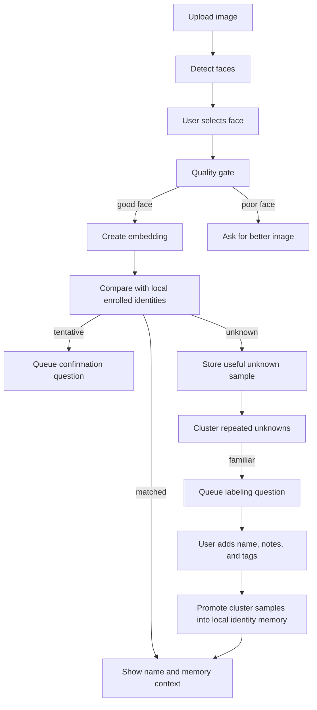

# Architecture

Self-Learning Vision is a local-first vision memory app. It detects faces in user-uploaded photos, stores identities that the user explicitly enrolls, and learns from repeated unknown faces without naming anyone automatically. The core memory layer is domain-expandable: face identity is the first built-in domain, and the same model can represent objects, places, scenes, events, or user-defined concepts.

## Flow

## Components

- `apps/api/app/main.py` exposes upload, Memory Run, enrollment, history, and deletion APIs.
- `RecognitionCoreService` handles face detection, quality checks, embedding extraction, matching, and memory summaries.
- `FaceReferenceRegistry` stores per-user enrolled identities as local JSON records.
- `MemoryEntityRegistry` stores generic domain entities such as `person`, `object`, `place`, `scene`, `event`, and custom user-defined domains.
- `UnknownFaceRegistry` stores high-quality unknown samples, clusters repeated unknowns, and tracks enrollment suggestions.
- `ActiveLearningRegistry` stores user-facing questions for tentative matches, familiar unknowns, and future correction workflows.
- `LearningSignalRegistry` stores redacted passive learning signals from memory runs, corrections, active-learning answers, lifecycle events, and replay.
- Learning services score question priority, evaluate memory health, detect contradictions, build evidence bundles, and apply replay.
- `CorrectionLogRegistry` stores correction history and undo snapshots for local memory edits.
- `apps/web` contains the Next.js UI for the ready-to-use app.

## API Vocabulary

- `POST /api/v1/upload` stores an image and returns detected face boxes.
- `POST /api/v1/memory-runs` starts a recognition pass against a selected face.
- `GET /api/v1/memory-runs` lists recent Memory Runs.
- `GET /api/v1/memory-runs/{id}` returns a Memory Report and activity.
- `POST /api/v1/memory-runs/{id}/reference` enrolls a selected face or promoted unknown cluster.
- `GET /api/v1/memory-run-events/stream` provides a lightweight event stream for UI refresh.
- `GET /api/v1/memory-domains` lists built-in and user-created memory domains.
- `GET /api/v1/memory-entities` lists generic memory entities, optionally filtered by `domain_type`.
- `POST /api/v1/memory-entities` creates or updates a user-defined memory entity.
- `GET /api/v1/active-learning/questions` lists active-learning questions.
- `POST /api/v1/active-learning/questions/{id}/response` records and applies a user response.
- `GET /api/v1/learning/signals` lists redacted passive learning signals.
- `GET /api/v1/learning/review-inbox` returns grouped questions, contradictions, candidate memories, low-health memories, and replay suggestions.
- `POST /api/v1/learning/signals/{id}/dismiss` dismisses a passive signal.
- `POST /api/v1/memory-entities/{id}/learning/replay` applies learning replay for a memory.
- `POST /api/v1/memory-entities/{id}/corrections/*` applies explicit memory corrections.
- `GET /api/v1/corrections` lists correction history.
- `POST /api/v1/corrections/{id}/undo` restores the previous memory snapshot for a correction.

## Storage

- Uploads live under `STORAGE_DIR`.
- Enrolled identities live under `STORAGE_DIR/face-references/{user_id}`.
- Generic memory entities live under `STORAGE_DIR/memory-entities/{user_id}`.
- Active-learning questions live under `STORAGE_DIR/active-learning/{user_id}`.
- Passive learning signals live under `STORAGE_DIR/learning-signals/{user_id}`.
- Correction logs live under `STORAGE_DIR/corrections/{user_id}`.
- Unknown samples and clusters live under `STORAGE_DIR/unknown-faces/{user_id}`.
- Local databases, uploads, references, embeddings, logs, and generated artifacts are ignored by Git.

## Generic Memory Model

The generic memory layer stores `MemoryEntity` records:

- `domain_type`: `person`, `object`, `place`, `scene`, `event`, or a custom user-defined type.
- `label`: the user-facing name.
- `attributes`: domain-specific metadata.
- `user_schema`: optional user-controlled field description.
- `observations`: source events that taught or reinforced the memory.
- `lifecycle_state`: `candidate`, `confirmed`, `uncertain`, `stale`, `archived`, or `forgotten`.

Face enrollment now feeds this layer by creating or updating a `person` entity. This keeps the current app usable while making the memory model ready for broader vision domains.

## Active Learning

The active-learning layer asks for confirmation only when the answer can improve local memory:

- tentative matches become confirm/reject questions;
- familiar unknown clusters become labeling questions;
- confirmed tentative matches reinforce local memory;
- labeled unknown clusters are promoted into local identity memory.

Questions are deduped by source context so the same upload or cluster does not create repeated pending work.

## Passive Learning And Review

Passive learning stores redacted `LearningSignal` records that describe useful
evidence without storing raw images, embeddings, upload paths, or provider
secrets. The Review Inbox combines these signals with active-learning questions,
memory health, contradictions, and replay suggestions.

Balanced-auto reinforcement can raise confidence for existing memories after
repeated high-confidence evidence. New trusted person identities remain
review-gated.

## Correction UX

Users can correct local memory through generic entity operations:

- rename;
- archive or forget;
- not this;
- merge;
- split;
- undo.

Corrections store local before/after snapshots so the app can undo mistakes without relying on hidden provider state.

## Memory Lifecycle

Each `MemoryEntity` tracks lifecycle state and lifecycle events:

- reinforcement raises confidence and can confirm a memory;
- stale decay lowers confidence when memory has not been reinforced;
- contradictions lower confidence and move memory to `uncertain`;
- correction flows such as "not this" also create lifecycle events.

Lifecycle metrics are exposed through `GET /api/v1/memory-lifecycle/summary` and included in evaluation summary output.

## Privacy Vault

The privacy vault layer controls redacted export/import and hosted-provider guardrails:

- biometric embeddings are excluded from exports;
- unknown-cluster centroid embeddings are excluded from exports;
- upload paths are excluded unless enabled in privacy settings;
- domains can be marked hidden for export;
- encrypted vault export/import uses `cryptography`;
- hosted providers are blocked while local-only mode is active.

## Provider Marketplace

The provider marketplace advertises local, hosted, paid, and custom providers through
provider cards. Cards include capabilities, data-transfer behavior, setup
requirements, cost model, and readiness status.

Provider selections are stored per user under `STORAGE_DIR/provider-selections/{user_id}`.
The active face embedding selection is honored by the recognition service, while
future capabilities such as object detection, captioning, OCR, and multimodal
reasoning are exposed as extension points.

## Provider Extension

The recognition layer is provider-oriented. The default path tries InsightFace/ArcFace when available and falls back to a deterministic local provider for development. Developers can add their own embedding or vision providers in `apps/api/app/services/recognition.py` without changing the API surface.

Provider selection is controlled by:

- `EMBEDDING_PROVIDER=auto`
- `PAID_PROVIDER_ENABLED=false`
- `PAID_PROVIDER_API_KEY=`

## Invariants

- Unknown faces never become named identities automatically.
- Tentative matches do not update identity memory as accepted sightings.
- Passive learning signals must stay redacted and metadata-only.
- Automatic reinforcement can improve existing memories, but cannot create a trusted person identity.
- Low-quality faces do not enter identity references or unknown clusters.
- User data stays scoped by user id.
- Promotion from unknown cluster to identity requires explicit user action.
- Face identity is a domain-specific provider, not the entire memory model.
- User-defined memory domains must remain local-first and user-controlled.
- Active-learning questions must be auditable and user-resolved; uncertain results should not silently become trusted memory.
- Corrections must be auditable and undoable whenever they change local memory.
- Memory confidence must change through explicit lifecycle events, not hidden side effects.
- Public exports must stay redacted by default and must not include biometric vectors.
- Hosted providers must be impossible to select while local-only policy blocks them.
